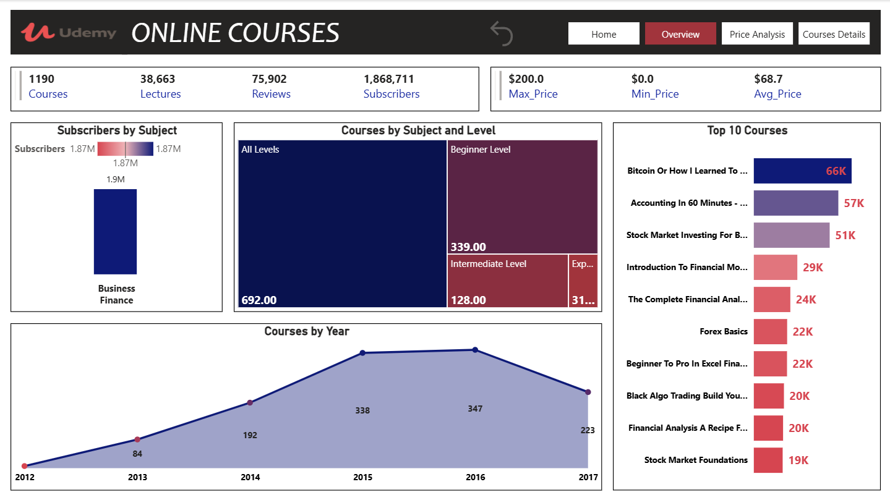

# 🎓 Udemy Online Courses Dashboard

## 🧩 Overview
This Power BI dashboard provides analytical insights into Udemy's **online course performance**, including total courses, subscribers, reviews, pricing, and course distribution across subjects and difficulty levels.  
It offers a high-level view of platform trends from **2012 to 2017**, helping identify popular subjects, top courses, and audience engagement patterns.

---

## 🚀 Key Metrics
| Metric | Value | Description |
|--------|--------|-------------|
| 🎥 **Courses** | **1,190** | Total number of courses analyzed. |
| 📚 **Lectures** | **38,663** | Total lectures available across all courses. |
| 💬 **Reviews** | **75,902** | Number of user reviews collected. |
| 👥 **Subscribers** | **1,868,711** | Total enrolled students across all courses. |
| 💵 **Max Price** | **$200.00** | Highest-priced course on the platform. |
| 💲 **Min Price** | **$0.00** | Indicates availability of free courses. |
| 💰 **Average Price** | **$68.70** | Average pricing across all courses. |

---

## 🧠 Subscribers by Subject
The **Business Finance** category dominates Udemy’s platform with approximately **1.9M subscribers**, highlighting strong learner demand for financial and investment-related education.

---

## 🧩 Courses by Subject and Level
| Level | Courses | Description |
|--------|----------|-------------|
| All Levels | 692 | Majority of courses are designed for general audiences. |
| Beginner | 339 | Courses for entry-level learners starting new skills. |
| Intermediate | 128 | Targeted for learners with some prior experience. |
| Expert | 31 | Advanced-level courses for professional learners. |

The large number of “All Levels” courses suggests that most instructors aim to reach a wide range of learners.

---

## 📈 Courses by Year
| Year | Courses Published |
|-------|--------------------|
| 2012 | 13 |
| 2013 | 84 |
| 2014 | 192 |
| 2015 | 338 |
| 2016 | 347 |
| 2017 | 223 |

Course creation grew rapidly between **2012 and 2016**, peaking in **2016** before a slight decline in 2017, reflecting market saturation or shifting instructor focus.

---

## 🏆 Top 10 Courses (by Subscribers)
| Rank | Course Name | Subscribers |
|------|--------------|-------------|
| 1️⃣ | Bitcoin or How I Learned to Stop Worrying | 66K |
| 2️⃣ | Accounting in 60 Minutes | 57K |
| 3️⃣ | Stock Market Investing for Beginners | 51K |
| 4️⃣ | Introduction to Financial Modeling | 29K |
| 5️⃣ | The Complete Financial Analyst Course | 24K |
| 6️⃣ | Forex Basics | 22K |
| 7️⃣ | Beginner to Pro in Excel Financial Modeling | 22K |
| 8️⃣ | Black Algo Trading Build Your Own Robot | 20K |
| 9️⃣ | Financial Analysis: A Recipe for Success | 20K |
| 🔟 | Stock Market Foundations | 19K |

These insights highlight the **popularity of finance, trading, and investment-related topics**, indicating where Udemy’s user demand is strongest.

---

## 💡 Insights Summary
- **Business Finance** dominates all other categories in terms of subscribers.  
- Majority of courses are **All Levels**, appealing to a broad range of learners.  
- Course creation peaked in **2016**, showing rapid platform growth.  
- **Top-performing courses** focus on Bitcoin, accounting, and investing — reflecting trending topics among learners.  
- Pricing ranges from **free to $200**, with an **average price of $68.7**.  

---

## 🛠️ Tools & Technologies
- **Power BI** – Data visualization and dashboard creation  
- **Excel / CSV** – Data preprocessing and transformation  
- **GitHub** – Project documentation and version control  

---

## 📸 Dashboard Preview

---

## 📎 Author
**Ibrahim Nady**  
Data Analyst | Power BI Developer  
📧 [ibrahimnady.abdelrahman@gmail.com]  
🌐 [www.linkedin.com/in/ibrahim-nady-466b931b6]

